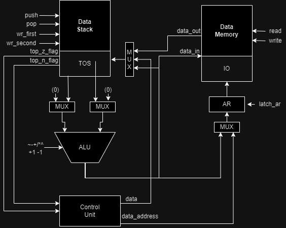
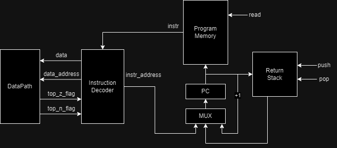

# Лабораторная работа №3 по Архитектуре Компьютера

-  Коваленко Илья Дмитриевич
- `forth | stack | harv | hw | instr | struct | trap - stream | mem | pstr | prob2 | cache`
-  Упрощенный вариант


## Расшифровка варианта
- Язык наподобие Forth (с обратной польской нотацией и поддержкой процедур)
- Стековая организация процессора
- Гарвардская архитектура
- Управление реализуется как часть модели
- Симуляция с точностью до инструкций
- Машинный код хранится как высокоуровневая структура
- Потоковый ввод вывод
- Устройства ввода-вывода адресуются через память
- Pascal string(длина + содержимое)
- Project euler problem 2 (Even Fibonacci numbers)


## Язык программирования


### Синтаксис
```ebnf
program ::= { term }

term ::= instr term_sep
       | [ comment ] "\n" | " "

term_sep ::= "\n" | " " | "\t"

instr ::= op 
        | procedure_name

op ::= "then"
     | "begin"
     | "until"
     | "key"
     | "."
     | ":"
     | ";"
     | "variable" label_name
     | positive_integer "allot"
     | "+!"
     | "!"
     | "dup"
     | "over"
     | "pop"
     | "swap"
     | integer
     | "@"
     | "+"
     | "-"
     | "*"
     | "/"
     | "="
     | ">"
     | "?"
     | "or"
     | "and"
     | "xor"
     | "inv"
     | "neg"
     | ."[a-Z]"
      
procedure_name ::= { [a-Z] }

positive_integer ::= { [0-9] }

integer ::= [ "-" ] positive_integer

comment ::= (<any symbols except "\n">)
```


### Семантика
   - Код выполняется последовательно, одна инструкция за другой.
   - Глобальная область видимости процедур и переменных
   - В программе не может быть дублирующихся названий процедур и переменных, определенных в разных местах с одним именем.
   - Синтаксис определения собственных процедур:
     - ":" для начала определения процедуры;
     - Комментарий об исполнении процедуры: `(операнды -- возвращаемое значение)`; 
     - Название процедуры;
     - Последовательность инструкций литералов и вызовов процедур для определения тела процедуры;
     - ";" для завершения определения процедуры.
   - Процедуры используют встроенные инструкции или другие процедуры
   - Использовать одну процедуру можно неограниченное количество раз.

Пример определения процедуры:
```forth
: arr_ptr ( offset -- addr) str_length + ;
```


### Литералы

- Любое целое число воспринимается как команда положить это число на вершину стека.

## Организация памяти

* Машинное слово – не определено. Реализуется высокоуровневой структурой данных. 
Операнд – 32-битный. Интерпретируется как знаковое целое число
* Адресация – прямая, абсолютная. Адрес берется из регистра AR
* Программист не взаимодействует с адресами памяти данных на прямую.
  Транслятор сам решает, в каком месте выделить память под программу и под данные программы.
* Программа и данные хранятся в раздельной памяти согласно Гарвардской архитектуре.
  Программа состоит из набора инструкций, последняя инструкция – `HLT`.
  Процедуры размещаются в той же памяти, они обязаны завершаться при помощи инструкции `RET`.
* Литералы - знаковые числа. Константы отсутствуют.
* Переменные отображаются в Data memory
* Устройства ввода-вывода отображаются в память
* У программиста нет доступа к памяти инструкций

```
    data stack
+------------------+
| 00 :     ...     |
| 01 :     52      |
|    :     ...     |
| tos:     102     |
| tos:     255     |
+------------------+


    data memory
+------------------+
| 00 :     101     |
| 01 :     52      |
|    :     ...     |
| 255:     io      |
+------------------+

 instruction memory 
+------------------+
| 00 :     ...     |
|    :             |
| p1 :     in      |
| p2 :     ret     |
|          ...     |
| n  :     hlt     |
+------------------+
```

## Система команд

Особенности процессора:

* Машинное слово – не определено.
* Тип данных - знаковые числа
* Доступ к памяти данных осуществляется по адресу из специального регистра AR. 
Значение в нем может быть защелкнуто либо из вершины стека либо из декодера инструкций
* Обработка данных осуществляется в стеке. Данные попадают в стек из:
  * Памяти
  * С помощью инструкции LIT.
  * АЛУ кладет результат вычислений на вершину стека.
* Поток управления:
  * Значение `PC` инкриминируется после исполнения каждой инструкции;
  * Условный (`JNZ`) и безусловный (`JUMP`) переходы;
Набор инструкций:

* `NOP` – нет операции.
* `LIT <literal>` – положить число на вершину стека.
* `LOAD { data_address }` – загрузить из памяти значение по адресу с вершины стека.
* `SAVE { data_address, element }` – положить значение в память по указанному адресу.
* `DUP { element }` – дублировать элемент, лежащий на вершине стека.
* `OVER { e1, e2 }` – дублировать элемент, лежащий на 1 глубже вершины
* `POP { e1 }` – удалить элемент со стека
* `SWAP { e1, e2 }` – обменять местами два элемента на стеке
* `ADD { e1, e2 }` – положить на стек результат операции сложения e2 + e1.
* `SUB { e1, e2 }` – положить на стек результат операции вычитания e2 - e1.
* `DIV { e1, e2 }` – положить на стек результат операции деления e2 / e1.
* `MUL { e1, e2 }` – положить на стек результат операции умножения e1 * e2.
* `INC { e1}` – положить на стек результат инкерментации верхнего значения стека e1+1.
* `DEC { e1 }` – положить на стек результат декремента верхнего значения стека e1-1.
* `AND { e1, e2 }` – положить на стек результат операции логического И.
* `OR { e1, e2 }` – положить на стек результат операции логического ИЛИ.
* `XOR { e1, e2 }` – положить на стек результат операции логического НЕ-ИЛИ.
* `INV {e1}` - инвертировать логическое значение на вершине стека.
* `NEG {e1}` - домножить значение на вершине стека на -1.
* `GT {e1, e2}` - положить на стек булевое значение операции e1-e2>0.
* `JMP < program_address >` – безусловный переход по указанному адресу.
* `JNZ { element } < program_address >` – если элемент не равен 0, начать исполнять инструкции по указанному адресу. Условный переход.
* `CALL < program_address >` – начать исполнение процедуры по указанному адресу.
* `RET` – вернуться из процедуры в основную программу, на следующий адрес.
* `HLT` – остановка тактового генератора.

Машинный код хранится в высокоуровневой структуре. 
Это реализуется списком словарей (в python соответствуют json объектам).
Один элемент списка — это одна инструкция.
Индекс инструкции в списке – адрес этой инструкции в памяти команд.

Пример машинного слова:
```json
{
  "opcode": "LIT",
  "arg": 2
}
```

Где:
* `opcode` – строка с кодом операции
* `operand` – аргумент команды (обязателен для инструкций с операндом)

Система команд реализована в модуле [isa.py](ak_lab3/isa.py).

## Транслятор
Интерфейс командной строки: `translator.py [-h] input_file output_file`

Реализовано в модуле [translator.py](ak_lab3/translator.py)

Этапы трансляции:

1. Препроцессинг: Удаление комментариев, разбиение на термы, проверка парности :; и begin-until
2. Трансляция кода в инструкции, адреса данных и инструкций остаются неразмеченными
3. Подстановка адресов в инструкции

Правила трансляции:
- Ссылаться можно только на существующие переменные и процедуры
- Все парные термы должны быть валидны
- В итоговом json документе отдельно вынесена секция кода и данных

## Модель процессора 
Интерфейс командной строки: `machine.py [-h] [--iotype [IOTYPE]] input_file output_file`

Реализован в модуле [machine.py](ak_lab3/machine.py)

### DataPath


Реализован в классе DataPath

data memory - однопортовая память, поэтому либо читаем, либо пишем.

Сигналы (обрабатываются за один такт, реализованы в виде методов класса):

- `latch_ar` - защелкнуть выбранное значение в address register
- `write` - записать выбранное значение в память по адресу ar
- `read` - прочитать значение из памяти по адресу ar
- `push` - положить выбранное значение на стек
- `pop` - удалить значение со стека (значение никуда не передается)
- `wr_second` - записать значение на вторую позицию стека
- `wr_first` - записать значение на вершину стека Флаги:
- `top_z_flag` - отражает равен ли верхний элемент на стеке 0
- `top_n_flag` - отражает меньше ли 0 верхний элемент на стеке

### ControlUnit


Реализовано в классе ControlUnit

- Hardwired (реализовано полностью на Python).
- instruction memory - однопортовая память, поэтому либо читаем, либо пишем.
- Выполняет предварительную инициализацию машины -- 
выполняет список инструкций, чтобы защелкнуть адрес первой инструкции в pc(метод initialize_pc)
- Выполнение и декодирование инструкций происходит в методе decode_and_execute_instruction.

Особенности работы модели:

- Цикл симуляции осуществляется в функции simulation.
- Шаг моделирования соответствует одной инструкции с выводом состояния в журнал.
- Для журнала состояний процессора используется стандартный модуль logging.
- Количество инструкций для моделирования лимитировано (1000).
- Остановка моделирования осуществляется при:
  - превышении лимита количества выполняемых инструкций; 
  - исключении StopIteration -- если выполнена инструкция hlt.

## Тестирование
- Тестирование выполняется при помощи golden test-ов.
- Настройка golden тестирования находится в файле [test_golden.py](tests/test_golden.py)
- Конфигурация golden test-ов лежит в директории [golden](tests/golden)

Запустить тесты: `poetry run pytest .` 

Обновить конфигурацию golden tests: `poetry run pytest . --update-goldens`

CI при помощи Github Actions:

CI-linter:
```yaml
name: CI - linter

on: [ push ]

jobs:
  build:
    runs-on: ubuntu-latest
    strategy:
      matrix:
        python-version: [ "3.12" ]
    steps:
      - name: Set up Python ${{ matrix.python-version }}
        uses: actions/setup-python@v3
        with:
          python-version: ${{ matrix.python-version }}
      - name: Install poetry
        run: |
          python -m pip install --upgrade pip
          curl -sSL https://install.python-poetry.org | python3 -
          export PATH="$HOME/.local/bin:$PATH"
      - uses: actions/checkout@v4
      - name: Install dependencies
        run: |
          poetry install
          poetry self add 'poethepoet[poetry_plugin]'
      - name: Run linters
        run: |
          poetry poe lint
```

CI-tester:
```yaml

name: CI - tester

on: [ push ]

jobs:
  build:
    runs-on: ubuntu-latest
    strategy:
      matrix:
        python-version: [ "3.12" ]
    steps:
      - name: Set up Python ${{ matrix.python-version }}
        uses: actions/setup-python@v3
        with:
          python-version: ${{ matrix.python-version }}
      - name: Install poetry
        run: |
          python -m pip install --upgrade pip
          curl -sSL https://install.python-poetry.org | python3 -
          export PATH="$HOME/.local/bin:$PATH"
      - uses: actions/checkout@v4
      - name: Install dependencies
        run: |
          poetry install
          poetry self add 'poethepoet[poetry_plugin]'
      - name: Test
        run: |
          poetry poe test
```
где:

- poetry - управления зависимостями для языка программирования Python.
- pytest - утилита для запуска тестов.
- mypy - утилита для статического анализа типов в коде
- pylint - утилита для статического анализа кода
- black - утилита для форматирования кода

Пример использования и журнал работы процессора на примере add:

```
> python -m ak_lab3.translator .\progs\raw\hello_world.fth .\progs\translated\hello_world.json
> python -m ak_lab3.machine .\progs\translated\hello_world.json .\progs\input\empty
DEBUG:root:TICK:    0 PC:    0 AR:    0 Z_FLAG: 1 N_FLAG: 0     {'opcode': 'lit', 'arg': 0}             DATA_STACK: [0, 0]                                                  RETURN_STACK: []
DEBUG:root:TICK:    3 PC:    1 AR:    0 Z_FLAG: 1 N_FLAG: 0     {'opcode': 'dup'}                       DATA_STACK: [0, 0, 0]                                               RETURN_STACK: []
DEBUG:root:TICK:    6 PC:    2 AR:    0 Z_FLAG: 1 N_FLAG: 0     {'opcode': 'load'}                      DATA_STACK: [0, 0, 0, 0]                                            RETURN_STACK: []
DEBUG:root:TICK:   10 PC:    3 AR:    0 Z_FLAG: 0 N_FLAG: 1     {'opcode': 'swap'}                      DATA_STACK: [0, 0, 0, 12]                                           RETURN_STACK: []
DEBUG:root:TICK:   15 PC:    4 AR:    0 Z_FLAG: 1 N_FLAG: 0     {'opcode': 'inc'}                       DATA_STACK: [0, 0, 12, 0]                                           RETURN_STACK: []
DEBUG:root:TICK:   18 PC:    5 AR:    0 Z_FLAG: 0 N_FLAG: 1     {'opcode': 'dup'}                       DATA_STACK: [0, 0, 12, 1]                                           RETURN_STACK: []
DEBUG:root:TICK:   21 PC:    6 AR:    0 Z_FLAG: 0 N_FLAG: 1     {'opcode': 'load'}                      DATA_STACK: [0, 0, 12, 1, 1]                                        RETURN_STACK: []
DEBUG:root:TICK:   25 PC:    7 AR:    1 Z_FLAG: 0 N_FLAG: 1     {'opcode': 'lit', 'arg': 255}           DATA_STACK: [0, 0, 12, 1, 72]                                       RETURN_STACK: []
DEBUG:root:TICK:   28 PC:    8 AR:    1 Z_FLAG: 0 N_FLAG: 1     {'opcode': 'save'}                      DATA_STACK: [0, 0, 12, 1, 72, 255]                                  RETURN_STACK: []
DEBUG:root:TICK:   33 PC:    9 AR:  255 Z_FLAG: 0 N_FLAG: 1     {'opcode': 'pop'}                       DATA_STACK: [0, 0, 12, 1, 72]                                       RETURN_STACK: []
DEBUG:root:TICK:   36 PC:   10 AR:  255 Z_FLAG: 0 N_FLAG: 1     {'opcode': 'swap'}                      DATA_STACK: [0, 0, 12, 1]                                           RETURN_STACK: []
DEBUG:root:TICK:   41 PC:   11 AR:  255 Z_FLAG: 0 N_FLAG: 1     {'opcode': 'dec'}                       DATA_STACK: [0, 0, 1, 12]                                           RETURN_STACK: []
DEBUG:root:TICK:   44 PC:   12 AR:  255 Z_FLAG: 0 N_FLAG: 1     {'opcode': 'jnz', 'arg': 3}             DATA_STACK: [0, 0, 1, 11]                                           RETURN_STACK: []
DEBUG:root:TICK:   47 PC:    3 AR:  255 Z_FLAG: 0 N_FLAG: 1     {'opcode': 'swap'}                      DATA_STACK: [0, 0, 1, 11]                                           RETURN_STACK: []
DEBUG:root:TICK:   52 PC:    4 AR:  255 Z_FLAG: 0 N_FLAG: 1     {'opcode': 'inc'}                       DATA_STACK: [0, 0, 11, 1]                                           RETURN_STACK: []
DEBUG:root:TICK:   55 PC:    5 AR:  255 Z_FLAG: 0 N_FLAG: 1     {'opcode': 'dup'}                       DATA_STACK: [0, 0, 11, 2]                                           RETURN_STACK: []
DEBUG:root:TICK:   58 PC:    6 AR:  255 Z_FLAG: 0 N_FLAG: 1     {'opcode': 'load'}                      DATA_STACK: [0, 0, 11, 2, 2]                                        RETURN_STACK: []
DEBUG:root:TICK:   62 PC:    7 AR:    2 Z_FLAG: 0 N_FLAG: 1     {'opcode': 'lit', 'arg': 255}           DATA_STACK: [0, 0, 11, 2, 101]                                      RETURN_STACK: []
DEBUG:root:TICK:   65 PC:    8 AR:    2 Z_FLAG: 0 N_FLAG: 1     {'opcode': 'save'}                      DATA_STACK: [0, 0, 11, 2, 101, 255]                                 RETURN_STACK: []
DEBUG:root:TICK:   70 PC:    9 AR:  255 Z_FLAG: 0 N_FLAG: 1     {'opcode': 'pop'}                       DATA_STACK: [0, 0, 11, 2, 101]                                      RETURN_STACK: []
DEBUG:root:TICK:   73 PC:   10 AR:  255 Z_FLAG: 0 N_FLAG: 1     {'opcode': 'swap'}                      DATA_STACK: [0, 0, 11, 2]                                           RETURN_STACK: []
DEBUG:root:TICK:   78 PC:   11 AR:  255 Z_FLAG: 0 N_FLAG: 1     {'opcode': 'dec'}                       DATA_STACK: [0, 0, 2, 11]                                           RETURN_STACK: []
DEBUG:root:TICK:   81 PC:   12 AR:  255 Z_FLAG: 0 N_FLAG: 1     {'opcode': 'jnz', 'arg': 3}             DATA_STACK: [0, 0, 2, 10]                                           RETURN_STACK: []
DEBUG:root:TICK:   84 PC:    3 AR:  255 Z_FLAG: 0 N_FLAG: 1     {'opcode': 'swap'}                      DATA_STACK: [0, 0, 2, 10]                                           RETURN_STACK: []
DEBUG:root:TICK:   89 PC:    4 AR:  255 Z_FLAG: 0 N_FLAG: 1     {'opcode': 'inc'}                       DATA_STACK: [0, 0, 10, 2]                                           RETURN_STACK: []
DEBUG:root:TICK:   92 PC:    5 AR:  255 Z_FLAG: 0 N_FLAG: 1     {'opcode': 'dup'}                       DATA_STACK: [0, 0, 10, 3]                                           RETURN_STACK: []
DEBUG:root:TICK:   95 PC:    6 AR:  255 Z_FLAG: 0 N_FLAG: 1     {'opcode': 'load'}                      DATA_STACK: [0, 0, 10, 3, 3]                                        RETURN_STACK: []
DEBUG:root:TICK:   99 PC:    7 AR:    3 Z_FLAG: 0 N_FLAG: 1     {'opcode': 'lit', 'arg': 255}           DATA_STACK: [0, 0, 10, 3, 108]                                      RETURN_STACK: []
DEBUG:root:TICK:  102 PC:    8 AR:    3 Z_FLAG: 0 N_FLAG: 1     {'opcode': 'save'}                      DATA_STACK: [0, 0, 10, 3, 108, 255]                                 RETURN_STACK: []
DEBUG:root:TICK:  107 PC:    9 AR:  255 Z_FLAG: 0 N_FLAG: 1     {'opcode': 'pop'}                       DATA_STACK: [0, 0, 10, 3, 108]                                      RETURN_STACK: []
DEBUG:root:TICK:  110 PC:   10 AR:  255 Z_FLAG: 0 N_FLAG: 1     {'opcode': 'swap'}                      DATA_STACK: [0, 0, 10, 3]                                           RETURN_STACK: []
DEBUG:root:TICK:  115 PC:   11 AR:  255 Z_FLAG: 0 N_FLAG: 1     {'opcode': 'dec'}                       DATA_STACK: [0, 0, 3, 10]                                           RETURN_STACK: []
DEBUG:root:TICK:  118 PC:   12 AR:  255 Z_FLAG: 0 N_FLAG: 1     {'opcode': 'jnz', 'arg': 3}             DATA_STACK: [0, 0, 3, 9]                                            RETURN_STACK: []
DEBUG:root:TICK:  121 PC:    3 AR:  255 Z_FLAG: 0 N_FLAG: 1     {'opcode': 'swap'}                      DATA_STACK: [0, 0, 3, 9]                                            RETURN_STACK: []
DEBUG:root:TICK:  126 PC:    4 AR:  255 Z_FLAG: 0 N_FLAG: 1     {'opcode': 'inc'}                       DATA_STACK: [0, 0, 9, 3]                                            RETURN_STACK: []
DEBUG:root:TICK:  129 PC:    5 AR:  255 Z_FLAG: 0 N_FLAG: 1     {'opcode': 'dup'}                       DATA_STACK: [0, 0, 9, 4]                                            RETURN_STACK: []
DEBUG:root:TICK:  132 PC:    6 AR:  255 Z_FLAG: 0 N_FLAG: 1     {'opcode': 'load'}                      DATA_STACK: [0, 0, 9, 4, 4]                                         RETURN_STACK: []
DEBUG:root:TICK:  136 PC:    7 AR:    4 Z_FLAG: 0 N_FLAG: 1     {'opcode': 'lit', 'arg': 255}           DATA_STACK: [0, 0, 9, 4, 108]                                       RETURN_STACK: []
DEBUG:root:TICK:  139 PC:    8 AR:    4 Z_FLAG: 0 N_FLAG: 1     {'opcode': 'save'}                      DATA_STACK: [0, 0, 9, 4, 108, 255]                                  RETURN_STACK: []
DEBUG:root:TICK:  144 PC:    9 AR:  255 Z_FLAG: 0 N_FLAG: 1     {'opcode': 'pop'}                       DATA_STACK: [0, 0, 9, 4, 108]                                       RETURN_STACK: []
DEBUG:root:TICK:  147 PC:   10 AR:  255 Z_FLAG: 0 N_FLAG: 1     {'opcode': 'swap'}                      DATA_STACK: [0, 0, 9, 4]                                            RETURN_STACK: []
DEBUG:root:TICK:  152 PC:   11 AR:  255 Z_FLAG: 0 N_FLAG: 1     {'opcode': 'dec'}                       DATA_STACK: [0, 0, 4, 9]                                            RETURN_STACK: []
DEBUG:root:TICK:  155 PC:   12 AR:  255 Z_FLAG: 0 N_FLAG: 1     {'opcode': 'jnz', 'arg': 3}             DATA_STACK: [0, 0, 4, 8]                                            RETURN_STACK: []
DEBUG:root:TICK:  158 PC:    3 AR:  255 Z_FLAG: 0 N_FLAG: 1     {'opcode': 'swap'}                      DATA_STACK: [0, 0, 4, 8]                                            RETURN_STACK: []
DEBUG:root:TICK:  163 PC:    4 AR:  255 Z_FLAG: 0 N_FLAG: 1     {'opcode': 'inc'}                       DATA_STACK: [0, 0, 8, 4]                                            RETURN_STACK: []
DEBUG:root:TICK:  166 PC:    5 AR:  255 Z_FLAG: 0 N_FLAG: 1     {'opcode': 'dup'}                       DATA_STACK: [0, 0, 8, 5]                                            RETURN_STACK: []
DEBUG:root:TICK:  169 PC:    6 AR:  255 Z_FLAG: 0 N_FLAG: 1     {'opcode': 'load'}                      DATA_STACK: [0, 0, 8, 5, 5]                                         RETURN_STACK: []
DEBUG:root:TICK:  173 PC:    7 AR:    5 Z_FLAG: 0 N_FLAG: 1     {'opcode': 'lit', 'arg': 255}           DATA_STACK: [0, 0, 8, 5, 111]                                       RETURN_STACK: []
DEBUG:root:TICK:  176 PC:    8 AR:    5 Z_FLAG: 0 N_FLAG: 1     {'opcode': 'save'}                      DATA_STACK: [0, 0, 8, 5, 111, 255]                                  RETURN_STACK: []
DEBUG:root:TICK:  181 PC:    9 AR:  255 Z_FLAG: 0 N_FLAG: 1     {'opcode': 'pop'}                       DATA_STACK: [0, 0, 8, 5, 111]                                       RETURN_STACK: []
DEBUG:root:TICK:  184 PC:   10 AR:  255 Z_FLAG: 0 N_FLAG: 1     {'opcode': 'swap'}                      DATA_STACK: [0, 0, 8, 5]                                            RETURN_STACK: []
DEBUG:root:TICK:  189 PC:   11 AR:  255 Z_FLAG: 0 N_FLAG: 1     {'opcode': 'dec'}                       DATA_STACK: [0, 0, 5, 8]                                            RETURN_STACK: []
DEBUG:root:TICK:  192 PC:   12 AR:  255 Z_FLAG: 0 N_FLAG: 1     {'opcode': 'jnz', 'arg': 3}             DATA_STACK: [0, 0, 5, 7]                                            RETURN_STACK: []
DEBUG:root:TICK:  195 PC:    3 AR:  255 Z_FLAG: 0 N_FLAG: 1     {'opcode': 'swap'}                      DATA_STACK: [0, 0, 5, 7]                                            RETURN_STACK: []
DEBUG:root:TICK:  200 PC:    4 AR:  255 Z_FLAG: 0 N_FLAG: 1     {'opcode': 'inc'}                       DATA_STACK: [0, 0, 7, 5]                                            RETURN_STACK: []
DEBUG:root:TICK:  203 PC:    5 AR:  255 Z_FLAG: 0 N_FLAG: 1     {'opcode': 'dup'}                       DATA_STACK: [0, 0, 7, 6]                                            RETURN_STACK: []
DEBUG:root:TICK:  206 PC:    6 AR:  255 Z_FLAG: 0 N_FLAG: 1     {'opcode': 'load'}                      DATA_STACK: [0, 0, 7, 6, 6]                                         RETURN_STACK: []
DEBUG:root:TICK:  210 PC:    7 AR:    6 Z_FLAG: 0 N_FLAG: 1     {'opcode': 'lit', 'arg': 255}           DATA_STACK: [0, 0, 7, 6, 32]                                        RETURN_STACK: []
DEBUG:root:TICK:  213 PC:    8 AR:    6 Z_FLAG: 0 N_FLAG: 1     {'opcode': 'save'}                      DATA_STACK: [0, 0, 7, 6, 32, 255]                                   RETURN_STACK: []
DEBUG:root:TICK:  218 PC:    9 AR:  255 Z_FLAG: 0 N_FLAG: 1     {'opcode': 'pop'}                       DATA_STACK: [0, 0, 7, 6, 32]                                        RETURN_STACK: []
DEBUG:root:TICK:  221 PC:   10 AR:  255 Z_FLAG: 0 N_FLAG: 1     {'opcode': 'swap'}                      DATA_STACK: [0, 0, 7, 6]                                            RETURN_STACK: []
DEBUG:root:TICK:  226 PC:   11 AR:  255 Z_FLAG: 0 N_FLAG: 1     {'opcode': 'dec'}                       DATA_STACK: [0, 0, 6, 7]                                            RETURN_STACK: []
DEBUG:root:TICK:  229 PC:   12 AR:  255 Z_FLAG: 0 N_FLAG: 1     {'opcode': 'jnz', 'arg': 3}             DATA_STACK: [0, 0, 6, 6]                                            RETURN_STACK: []
DEBUG:root:TICK:  232 PC:    3 AR:  255 Z_FLAG: 0 N_FLAG: 1     {'opcode': 'swap'}                      DATA_STACK: [0, 0, 6, 6]                                            RETURN_STACK: []
DEBUG:root:TICK:  237 PC:    4 AR:  255 Z_FLAG: 0 N_FLAG: 1     {'opcode': 'inc'}                       DATA_STACK: [0, 0, 6, 6]                                            RETURN_STACK: []
DEBUG:root:TICK:  240 PC:    5 AR:  255 Z_FLAG: 0 N_FLAG: 1     {'opcode': 'dup'}                       DATA_STACK: [0, 0, 6, 7]                                            RETURN_STACK: []
DEBUG:root:TICK:  243 PC:    6 AR:  255 Z_FLAG: 0 N_FLAG: 1     {'opcode': 'load'}                      DATA_STACK: [0, 0, 6, 7, 7]                                         RETURN_STACK: []
DEBUG:root:TICK:  247 PC:    7 AR:    7 Z_FLAG: 0 N_FLAG: 1     {'opcode': 'lit', 'arg': 255}           DATA_STACK: [0, 0, 6, 7, 87]                                        RETURN_STACK: []
DEBUG:root:TICK:  250 PC:    8 AR:    7 Z_FLAG: 0 N_FLAG: 1     {'opcode': 'save'}                      DATA_STACK: [0, 0, 6, 7, 87, 255]                                   RETURN_STACK: []
DEBUG:root:TICK:  255 PC:    9 AR:  255 Z_FLAG: 0 N_FLAG: 1     {'opcode': 'pop'}                       DATA_STACK: [0, 0, 6, 7, 87]                                        RETURN_STACK: []
DEBUG:root:TICK:  258 PC:   10 AR:  255 Z_FLAG: 0 N_FLAG: 1     {'opcode': 'swap'}                      DATA_STACK: [0, 0, 6, 7]                                            RETURN_STACK: []
DEBUG:root:TICK:  263 PC:   11 AR:  255 Z_FLAG: 0 N_FLAG: 1     {'opcode': 'dec'}                       DATA_STACK: [0, 0, 7, 6]                                            RETURN_STACK: []
DEBUG:root:TICK:  266 PC:   12 AR:  255 Z_FLAG: 0 N_FLAG: 1     {'opcode': 'jnz', 'arg': 3}             DATA_STACK: [0, 0, 7, 5]                                            RETURN_STACK: []
DEBUG:root:TICK:  269 PC:    3 AR:  255 Z_FLAG: 0 N_FLAG: 1     {'opcode': 'swap'}                      DATA_STACK: [0, 0, 7, 5]                                            RETURN_STACK: []
DEBUG:root:TICK:  274 PC:    4 AR:  255 Z_FLAG: 0 N_FLAG: 1     {'opcode': 'inc'}                       DATA_STACK: [0, 0, 5, 7]                                            RETURN_STACK: []
DEBUG:root:TICK:  277 PC:    5 AR:  255 Z_FLAG: 0 N_FLAG: 1     {'opcode': 'dup'}                       DATA_STACK: [0, 0, 5, 8]                                            RETURN_STACK: []
DEBUG:root:TICK:  280 PC:    6 AR:  255 Z_FLAG: 0 N_FLAG: 1     {'opcode': 'load'}                      DATA_STACK: [0, 0, 5, 8, 8]                                         RETURN_STACK: []
DEBUG:root:TICK:  284 PC:    7 AR:    8 Z_FLAG: 0 N_FLAG: 1     {'opcode': 'lit', 'arg': 255}           DATA_STACK: [0, 0, 5, 8, 111]                                       RETURN_STACK: []
DEBUG:root:TICK:  287 PC:    8 AR:    8 Z_FLAG: 0 N_FLAG: 1     {'opcode': 'save'}                      DATA_STACK: [0, 0, 5, 8, 111, 255]                                  RETURN_STACK: []
DEBUG:root:TICK:  292 PC:    9 AR:  255 Z_FLAG: 0 N_FLAG: 1     {'opcode': 'pop'}                       DATA_STACK: [0, 0, 5, 8, 111]                                       RETURN_STACK: []
DEBUG:root:TICK:  295 PC:   10 AR:  255 Z_FLAG: 0 N_FLAG: 1     {'opcode': 'swap'}                      DATA_STACK: [0, 0, 5, 8]                                            RETURN_STACK: []
DEBUG:root:TICK:  300 PC:   11 AR:  255 Z_FLAG: 0 N_FLAG: 1     {'opcode': 'dec'}                       DATA_STACK: [0, 0, 8, 5]                                            RETURN_STACK: []
DEBUG:root:TICK:  303 PC:   12 AR:  255 Z_FLAG: 0 N_FLAG: 1     {'opcode': 'jnz', 'arg': 3}             DATA_STACK: [0, 0, 8, 4]                                            RETURN_STACK: []
DEBUG:root:TICK:  306 PC:    3 AR:  255 Z_FLAG: 0 N_FLAG: 1     {'opcode': 'swap'}                      DATA_STACK: [0, 0, 8, 4]                                            RETURN_STACK: []
DEBUG:root:TICK:  311 PC:    4 AR:  255 Z_FLAG: 0 N_FLAG: 1     {'opcode': 'inc'}                       DATA_STACK: [0, 0, 4, 8]                                            RETURN_STACK: []
DEBUG:root:TICK:  314 PC:    5 AR:  255 Z_FLAG: 0 N_FLAG: 1     {'opcode': 'dup'}                       DATA_STACK: [0, 0, 4, 9]                                            RETURN_STACK: []
DEBUG:root:TICK:  317 PC:    6 AR:  255 Z_FLAG: 0 N_FLAG: 1     {'opcode': 'load'}                      DATA_STACK: [0, 0, 4, 9, 9]                                         RETURN_STACK: []
DEBUG:root:TICK:  321 PC:    7 AR:    9 Z_FLAG: 0 N_FLAG: 1     {'opcode': 'lit', 'arg': 255}           DATA_STACK: [0, 0, 4, 9, 114]                                       RETURN_STACK: []
DEBUG:root:TICK:  324 PC:    8 AR:    9 Z_FLAG: 0 N_FLAG: 1     {'opcode': 'save'}                      DATA_STACK: [0, 0, 4, 9, 114, 255]                                  RETURN_STACK: []
DEBUG:root:TICK:  329 PC:    9 AR:  255 Z_FLAG: 0 N_FLAG: 1     {'opcode': 'pop'}                       DATA_STACK: [0, 0, 4, 9, 114]                                       RETURN_STACK: []
DEBUG:root:TICK:  332 PC:   10 AR:  255 Z_FLAG: 0 N_FLAG: 1     {'opcode': 'swap'}                      DATA_STACK: [0, 0, 4, 9]                                            RETURN_STACK: []
DEBUG:root:TICK:  337 PC:   11 AR:  255 Z_FLAG: 0 N_FLAG: 1     {'opcode': 'dec'}                       DATA_STACK: [0, 0, 9, 4]                                            RETURN_STACK: []
DEBUG:root:TICK:  340 PC:   12 AR:  255 Z_FLAG: 0 N_FLAG: 1     {'opcode': 'jnz', 'arg': 3}             DATA_STACK: [0, 0, 9, 3]                                            RETURN_STACK: []
DEBUG:root:TICK:  343 PC:    3 AR:  255 Z_FLAG: 0 N_FLAG: 1     {'opcode': 'swap'}                      DATA_STACK: [0, 0, 9, 3]                                            RETURN_STACK: []
DEBUG:root:TICK:  348 PC:    4 AR:  255 Z_FLAG: 0 N_FLAG: 1     {'opcode': 'inc'}                       DATA_STACK: [0, 0, 3, 9]                                            RETURN_STACK: []
DEBUG:root:TICK:  351 PC:    5 AR:  255 Z_FLAG: 0 N_FLAG: 1     {'opcode': 'dup'}                       DATA_STACK: [0, 0, 3, 10]                                           RETURN_STACK: []
DEBUG:root:TICK:  354 PC:    6 AR:  255 Z_FLAG: 0 N_FLAG: 1     {'opcode': 'load'}                      DATA_STACK: [0, 0, 3, 10, 10]                                       RETURN_STACK: []
DEBUG:root:TICK:  358 PC:    7 AR:   10 Z_FLAG: 0 N_FLAG: 1     {'opcode': 'lit', 'arg': 255}           DATA_STACK: [0, 0, 3, 10, 108]                                      RETURN_STACK: []
DEBUG:root:TICK:  361 PC:    8 AR:   10 Z_FLAG: 0 N_FLAG: 1     {'opcode': 'save'}                      DATA_STACK: [0, 0, 3, 10, 108, 255]                                 RETURN_STACK: []
DEBUG:root:TICK:  366 PC:    9 AR:  255 Z_FLAG: 0 N_FLAG: 1     {'opcode': 'pop'}                       DATA_STACK: [0, 0, 3, 10, 108]                                      RETURN_STACK: []
DEBUG:root:TICK:  369 PC:   10 AR:  255 Z_FLAG: 0 N_FLAG: 1     {'opcode': 'swap'}                      DATA_STACK: [0, 0, 3, 10]                                           RETURN_STACK: []
DEBUG:root:TICK:  374 PC:   11 AR:  255 Z_FLAG: 0 N_FLAG: 1     {'opcode': 'dec'}                       DATA_STACK: [0, 0, 10, 3]                                           RETURN_STACK: []
DEBUG:root:TICK:  377 PC:   12 AR:  255 Z_FLAG: 0 N_FLAG: 1     {'opcode': 'jnz', 'arg': 3}             DATA_STACK: [0, 0, 10, 2]                                           RETURN_STACK: []
DEBUG:root:TICK:  380 PC:    3 AR:  255 Z_FLAG: 0 N_FLAG: 1     {'opcode': 'swap'}                      DATA_STACK: [0, 0, 10, 2]                                           RETURN_STACK: []
DEBUG:root:TICK:  385 PC:    4 AR:  255 Z_FLAG: 0 N_FLAG: 1     {'opcode': 'inc'}                       DATA_STACK: [0, 0, 2, 10]                                           RETURN_STACK: []
DEBUG:root:TICK:  388 PC:    5 AR:  255 Z_FLAG: 0 N_FLAG: 1     {'opcode': 'dup'}                       DATA_STACK: [0, 0, 2, 11]                                           RETURN_STACK: []
DEBUG:root:TICK:  391 PC:    6 AR:  255 Z_FLAG: 0 N_FLAG: 1     {'opcode': 'load'}                      DATA_STACK: [0, 0, 2, 11, 11]                                       RETURN_STACK: []
DEBUG:root:TICK:  395 PC:    7 AR:   11 Z_FLAG: 0 N_FLAG: 1     {'opcode': 'lit', 'arg': 255}           DATA_STACK: [0, 0, 2, 11, 100]                                      RETURN_STACK: []
DEBUG:root:TICK:  398 PC:    8 AR:   11 Z_FLAG: 0 N_FLAG: 1     {'opcode': 'save'}                      DATA_STACK: [0, 0, 2, 11, 100, 255]                                 RETURN_STACK: []
DEBUG:root:TICK:  403 PC:    9 AR:  255 Z_FLAG: 0 N_FLAG: 1     {'opcode': 'pop'}                       DATA_STACK: [0, 0, 2, 11, 100]                                      RETURN_STACK: []
DEBUG:root:TICK:  406 PC:   10 AR:  255 Z_FLAG: 0 N_FLAG: 1     {'opcode': 'swap'}                      DATA_STACK: [0, 0, 2, 11]                                           RETURN_STACK: []
DEBUG:root:TICK:  411 PC:   11 AR:  255 Z_FLAG: 0 N_FLAG: 1     {'opcode': 'dec'}                       DATA_STACK: [0, 0, 11, 2]                                           RETURN_STACK: []
DEBUG:root:TICK:  414 PC:   12 AR:  255 Z_FLAG: 0 N_FLAG: 1     {'opcode': 'jnz', 'arg': 3}             DATA_STACK: [0, 0, 11, 1]                                           RETURN_STACK: []
DEBUG:root:TICK:  417 PC:    3 AR:  255 Z_FLAG: 0 N_FLAG: 1     {'opcode': 'swap'}                      DATA_STACK: [0, 0, 11, 1]                                           RETURN_STACK: []
DEBUG:root:TICK:  422 PC:    4 AR:  255 Z_FLAG: 0 N_FLAG: 1     {'opcode': 'inc'}                       DATA_STACK: [0, 0, 1, 11]                                           RETURN_STACK: []
DEBUG:root:TICK:  425 PC:    5 AR:  255 Z_FLAG: 0 N_FLAG: 1     {'opcode': 'dup'}                       DATA_STACK: [0, 0, 1, 12]                                           RETURN_STACK: []
DEBUG:root:TICK:  428 PC:    6 AR:  255 Z_FLAG: 0 N_FLAG: 1     {'opcode': 'load'}                      DATA_STACK: [0, 0, 1, 12, 12]                                       RETURN_STACK: []
DEBUG:root:TICK:  432 PC:    7 AR:   12 Z_FLAG: 0 N_FLAG: 1     {'opcode': 'lit', 'arg': 255}           DATA_STACK: [0, 0, 1, 12, 33]                                       RETURN_STACK: []
DEBUG:root:TICK:  435 PC:    8 AR:   12 Z_FLAG: 0 N_FLAG: 1     {'opcode': 'save'}                      DATA_STACK: [0, 0, 1, 12, 33, 255]                                  RETURN_STACK: []
DEBUG:root:TICK:  440 PC:    9 AR:  255 Z_FLAG: 0 N_FLAG: 1     {'opcode': 'pop'}                       DATA_STACK: [0, 0, 1, 12, 33]                                       RETURN_STACK: []
DEBUG:root:TICK:  443 PC:   10 AR:  255 Z_FLAG: 0 N_FLAG: 1     {'opcode': 'swap'}                      DATA_STACK: [0, 0, 1, 12]                                           RETURN_STACK: []
DEBUG:root:TICK:  448 PC:   11 AR:  255 Z_FLAG: 0 N_FLAG: 1     {'opcode': 'dec'}                       DATA_STACK: [0, 0, 12, 1]                                           RETURN_STACK: []
DEBUG:root:TICK:  451 PC:   12 AR:  255 Z_FLAG: 1 N_FLAG: 0     {'opcode': 'jnz', 'arg': 3}             DATA_STACK: [0, 0, 12, 0]                                           RETURN_STACK: []
DEBUG:root:TICK:  453 PC:   13 AR:  255 Z_FLAG: 1 N_FLAG: 0     {'opcode': 'pop'}                       DATA_STACK: [0, 0, 12, 0]                                           RETURN_STACK: []
DEBUG:root:TICK:  456 PC:   14 AR:  255 Z_FLAG: 0 N_FLAG: 1     {'opcode': 'pop'}                       DATA_STACK: [0, 0, 12]                                              RETURN_STACK: []
DEBUG:root:TICK:  459 PC:   15 AR:  255 Z_FLAG: 1 N_FLAG: 0     {'opcode': 'hlt'}                       DATA_STACK: [0, 0]                                                  RETURN_STACK: []
INFO:root:output buffer: Hello World!
output: Hello World!
instr_counter:  125 ticks:  461
```